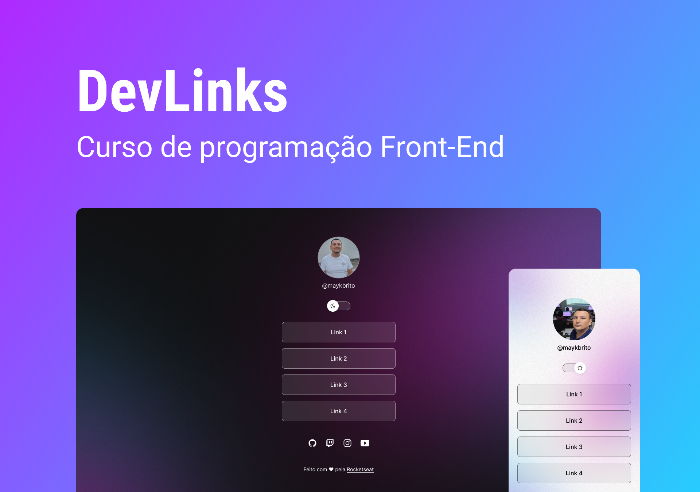

<h1 align="center"> DevLinks </h1>

Programa exclusivo e gratuito, promovido pela Rocketseat para ensino de tecnologias WEB.  

  <a href="#-tecnologias">Tecnologias</a>&nbsp;&nbsp;&nbsp;|&nbsp;&nbsp;&nbsp;
  <a href="#-projeto">Projeto</a>&nbsp;&nbsp;&nbsp;|&nbsp;&nbsp;&nbsp;
  <a href="#-layout">Layout</a>&nbsp;&nbsp;&nbsp;|&nbsp;&nbsp;&nbsp;

 Para visualizar o projeto no seu navegador:
  <a href="https://cartao-de-visita-washiner.netlify.app/">Clique aqui</a>

 

  

## 🚀 Tecnologias

Esse projeto foi desenvolvido com as seguintes tecnologias:

- HTML e CSS
- JavaScript
- Git e Github
- Figma

## 💻 Projeto

O DevLinks é um curso gratuito da Rocktseat onde aprimorei meus conhecimentos em html, css e javascript colocando em prática varios conceitos como funções, manipulação de Dom estilização de textos e atributos entre outros.

## 🔖 Layout

Você pode visualizar outro projeto usando as mesmas tecnologias [DESSE LINK](https://washiner.github.io/agencia-washiner/).

Feito com ♥ by Rocketseat :wave: [Participe da nossa comunidade!](https://discord.gg/rocketseat)
